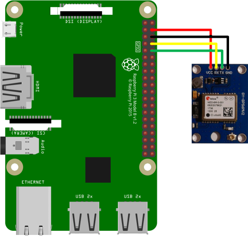
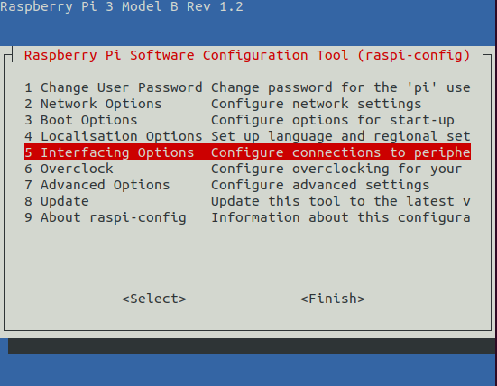
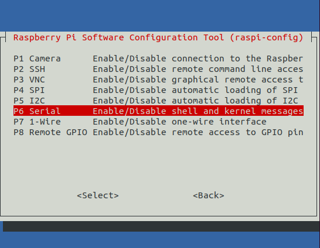

<p>
<a href="https://github.com/FabianBe/BirdDetectionStation/actions/workflows/test.yml"></a>
<a href="https://github.com/FabianBe/BirdDetectionStation/blob/main/LICENSE""></a>
<a href="https://github.com/psf/black"></a>
</p>

# Preamble
The classification algorithm and the corresponding model are extracted from [BirdNET-Electron](https://github.com/kahst/BirdNET-Electron).
Many thanks to Stefan Kahl.

# Setup
1. Install Raspberry Pi OS Lite (skip this section if you are already familiar with installing Raspberry Pi OS Lite)
    * Download the [Raspberry Pi OS Lite image](https://www.raspberrypi.org/software/operating-systems/#raspberry-pi-os-32-bit)
    * Flash the image to a microSD card
      * The flashing can be done using a tool like [balenaEtcher](https://www.balena.io/etcher/)
    * To be able to connect to the Pi over SSH make sure to enable SSH
      * Put the microSD card into a card reader
      * Navigate to the boot directory
      * Create an empty file named `ssh` without an extension
        ```bash
        cd <path_to_sd_card>
        touch ssh
        ```

2. Attach and enable the GPS sensor (GY-GPS6MV2)
    1. Attach the GPS sensor according to the following picture
       <p align="center">
         
       </p>                                                                                       
    2. Attach the Pi to a power source
    3. Log in as user `pi` with password `raspberry`
    4. Run the following command to configure the Pi
    ```bash
    sudo raspi-config
    ```
    5. Navigate to the point `Interface Options`
       <p align="center">
         
       </p> 
    6. Enable Serial
       <p align="center">
         
       </p> 
    7.  Would you like a login shell to be accessible over serial?  
      -> No
    8. Would you like the serial port hardware to be enabled?  
      -> Yes  
# Installation
1. Install the required software and dependencies
    1. sudo apt update
        ```bash
        sudo apt update
        ```
    1. Install git
        ```bash
        sudo apt install git
        ```
   2. Clone the repository
        ```bash
        git clone https://github.com/FabianBe/BirdDetectionStation
        ```
   3. Execute the installation script (this may take a while):
      ```bash
      cd BirdDetectionStation
      chmod +x install.sh
      sudo bash install.sh
      ```
    4. If the installation was successful, your Raspberry Pi will restart and the bird station is ready to use. Please make sure to edit the config file `bird_detection_station/config.yml` according to your preferences otherwise the bird station might not start correctly.
       1. The most important configuration parameter is the `sound_device`, make sure to specify a correct value. If you are not sure which value to use, you need to start the bird_detection service manually or use the sound_device python module (`python3 -m sounddevice`)
       2. To start the service manually you need to activate the virtual environment:
          ```bash
          cd BirdDetectionStation/bird_detection_station
          source .venv/bin/activate
          python -m bird_detection.main
          ```
          If no default sound device is configured or the bird detection station is not able to choose a sound device by itself, you will see a list to choose from. Please configure the `config.yml` accordingly to ensure that the bird detection station can start at boot time. See also the [troubleshooting section](#Troubleshooting).

# Usage

## Configuration

The bird detection station can be configured via the config.yml using the following parameters

* *station_type* [ONLINE | OFFLINE | OFFLINE_CLASSIFICATION]
  * OFFLINE: Run the station without classification and HTTP API. Sounds which exceed the `is_silent_threshold` parameter are saved in the `/BirdDetectionStation/bird_detection_station/data` directory.
  * OFFLINE_CLASSIFICATION: The classification is carried out on the Raspberry Pi.
  * ONLINE: The results of the classification will be disseminated via MQTT. Please make sure that you specify an MQTT broker in the configuration file.

* *sound_device*: The identifier of the sound device which should be used for recording

* *recording_time*: Specifies the recording time, in minutes, after a sound occurred
* *is_silent_threshold*: The threshold the sound needs to exceed in order to trigger a recording
* *accuracy_threshold*: The threshold or accuracy the classifier needs to provide to trigger a new bird detection event

* *host_url*: the URL or IP of the bird detection station e.g. `localhost:8000` or `bird_detection_station.lan:8000`

* *classifier_url*: the classifier_url of the bird sound classification service. This value is only important for the ONLINE station type

* *gps_coordinates*: Fallback GPS coordinates in case no GPS sensor is attached
* *mqtt_broker*: The URL or IP address of the MQTT broker which is used in case of an ONLINE station type
* *mqtt_port*: The port of the MQTT broker
* *api_key*: An OpenWeatherMap API-key which enables the station to obtain weather data

## Interaction with the bird detection station
The bird detection station can be controlled by using a HTTP API. The documentation of the API can be obtained via swagger `BIRD_STATION_IP:8000/docs` or by using the [Thing Description](https://www.w3.org/TR/wot-thing-description/) `BIRD_STATION_IP:8000/`

# Troubleshooting
1. To verify if the services have started successfully use:
    ```bash
    systemctl status bird_station.service
    systemctl status bird_detection.service
    ```
2. Log messages can be examined using journalctl:
    ```bash
    journalctl -u bird_station.service
    journalctl -u bird_detection.service
    ```
